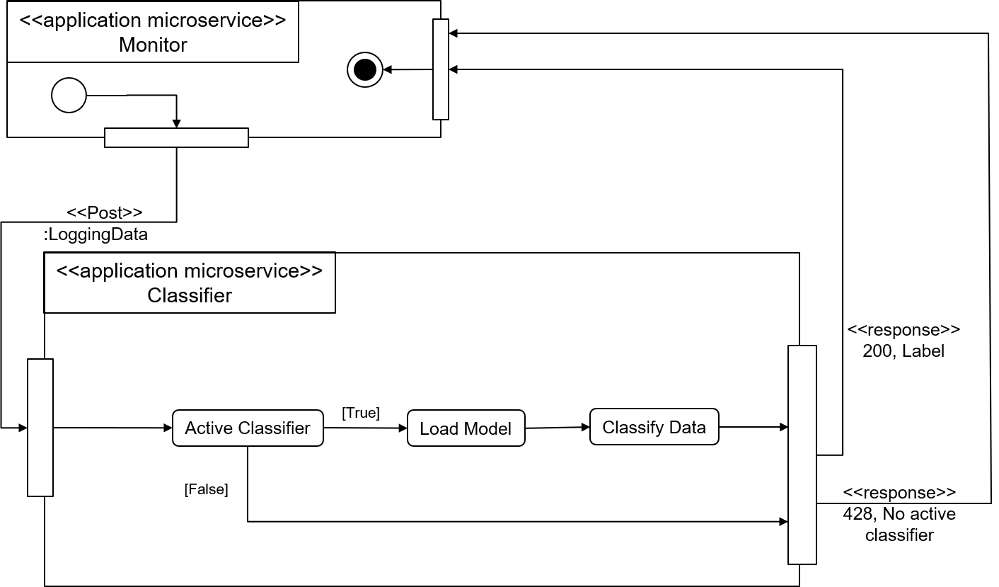

# Task Processes
## Request Classification

First, it is checked if a classifier is deployed. If a model is deployed, it is loaded. Then, the data sent with the request the is classified with the active classifier.
## Train Machine Learning Model

The process is iniated in the frontend by sending POST request to the backend; the request contains a filtername and a modelname. First, it is checked if the modelname already exists. Then the training data is loaded from the disk and filtered based on the filtername. Then the model is created and fitted with the filtered trainingsdata. After it is fitted, the model's accuracy is calculated with a testset which is not part of the trainingsset. As last step the model is saved on the disk and the information about the model, like model path, modelname and filtername is saved to the database. The accuracy is returned as response to the POST requets.
## Delete Machine Learning Model

 If the user decided to delete a model, a DELETE request with the modelname is sent to the microservice. After receiving the request, it is checked if the model exists. Then it is deleted, the deletion process begins with deleting the model on the disk, then with dropping all rows in the database table modelUsage, then the entry in the model table.
